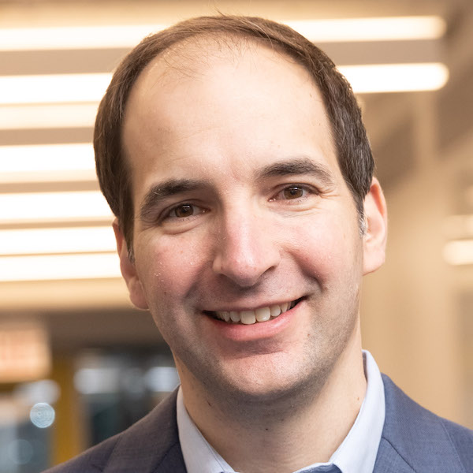

# Fall 2022
### Thursdays, 11:00am-12:20pm

 

### Nov 17th - [Marc Berman](https://github.com/uchicago-computation-workshop/Fall2022/tree/main/01_12_Berman)

### Nov 17th - [Alexander Todorov](https://github.com/uchicago-computation-workshop/Fall2022/tree/main/11_17_%20Todorov)

### Nov 10th - [Suresh Naidu](https://github.com/uchicago-computation-workshop/Fall2022/tree/main/11_10_%20Suresh)

### Nov 3rd - [Eric Jonas](https://github.com/uchicago-computation-workshop/Fall2022/tree/main/11_03_Jonas)

### Oct 27th - [Hoda Heidari](https://github.com/uchicago-computation-workshop/Fall2022/tree/add-new-speaker-file/10-27_hoda)

### Sep 29th - [James Evans](https://github.com/uchicago-computation-workshop/Fall2022/tree/add-new-speaker-file/09-29_Evans)

