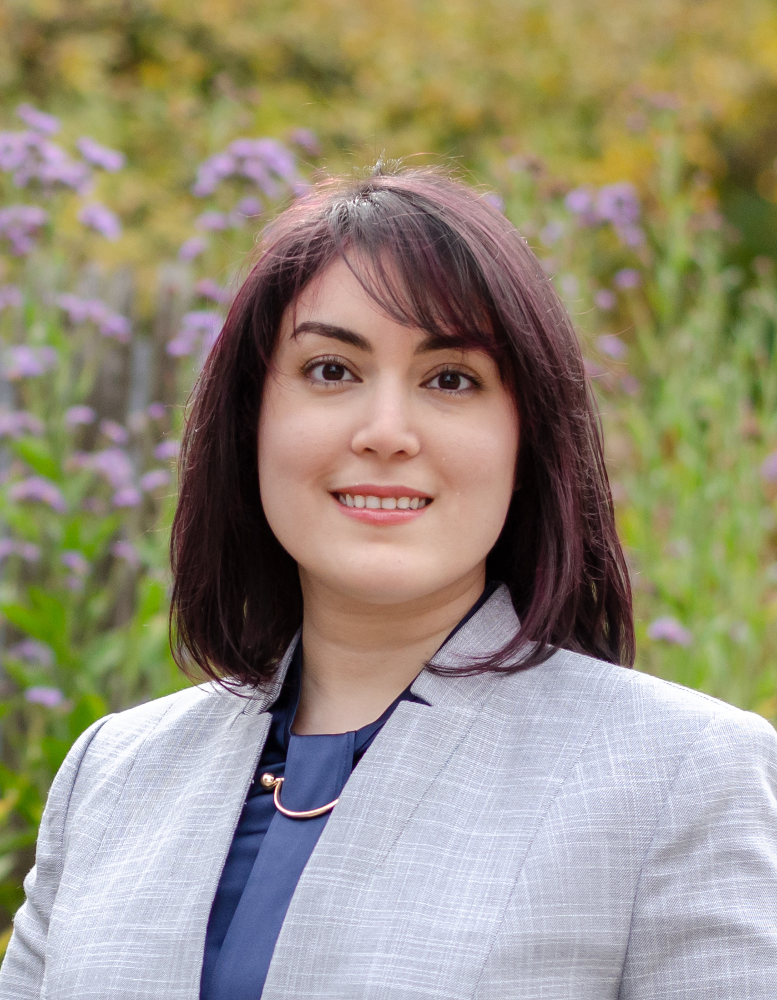

# Fall 2022
### Thursdays, 11:00am-12:20pm

 

### Oct 27th - [Hoda Heidari](https://github.com/uchicago-computation-workshop/Fall2022/tree/add-new-speaker-file/10-27_hoda)

### Sep 29th - [James Evans](https://github.com/uchicago-computation-workshop/Fall2022/tree/add-new-speaker-file/09-29_Evans)

